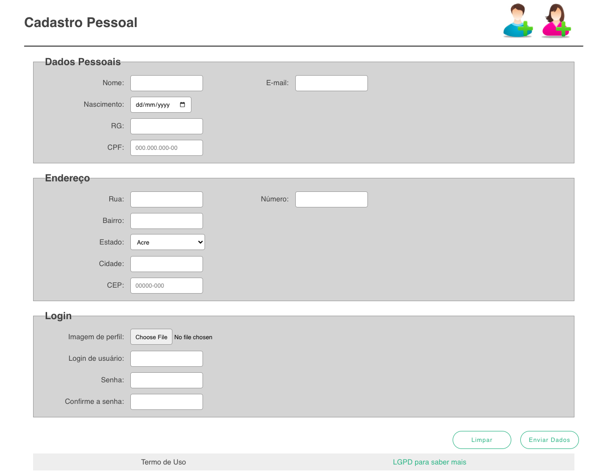

## Formulário
 Repositório de código de Front-End de um formulário de cadastro.

 <h2> Sistemas do Cursos</h2>
 <h3> Programção Front-End</h3>

 Este projeto é uma aplicação web frontend que inclui um formulário dinâmico e responsivo utilizando apenas HTML e CSS. O formulário foi projetado para coletar informações do usuário e apresentar uma interface amigável e acessível.

## Projeto final 🚀

